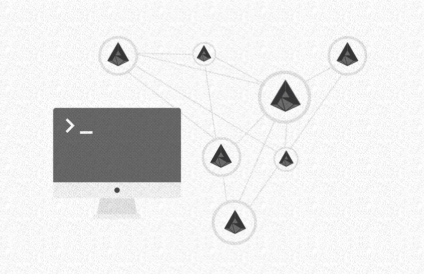

# ADAMANT

ADAMANT is a **decentralized blockchain messaging platform**. Applications use ADAMANT as an anonymous and encrypted relay and storage to enable messaging features. As examples, see [Messenger app](https://github.com/Adamant-im/adamant-im), [Blockchain 2FA](https://github.com/Adamant-im/adamant-2fa) and [Cryptocurrency Exchanger](https://github.com/Adamant-im/adamant-exchangebot) implementations.

For more information refer to ADAMANT website: <https://adamant.im>.



Additional information:

- [How decentralized blockchain messenger works](https://medium.com/adamant-im/how-decentralized-blockchain-messenger-works-b9932834a639)
- [Encryption overview in ADAMANT Messenger](https://medium.com/adamant-im/encryption-overview-in-adamant-messenger-878ecec1ff78)

[](http://www.gnu.org/licenses/gpl-3.0)

## API Documentation

Comprehensive [API specification](https://github.com/Adamant-im/adamant/wiki) is available.

The manual describes API endpoints to manage accounts, transactions, chats, and a key-value storage (KVS). Additionally, the manual suggests valuable information on creating new accounts and encrypting and decrypting messages.

## Set up

[How to run ADAMANT node (instructions for users)](https://medium.com/adamant-im/how-to-run-your-adamant-node-on-ubuntu-990e391e8fcc). You can skip them if you are experienced Linux user.

### Requirements

- Ubuntu 18/20/22 (others are not tested)
- 2 GB RAM
- 60 GB disk space as on November 2022

### Installation script

For new droplets, use the [Installation script](./tools/install_node.sh), included in this repository, or run it from the ADAMANT website:

`sudo bash -c "$(wget -O - https://adamant.im/install_node.sh)"`

The script updates Ubuntu packages, creates user named adamant, installs PostgreSQL, Node.js and other necessary packages, sets up ADAMANT node, and optionally downloads up-to-date ADAMANT blockchain image.

Script parameters:

- `-b`: choose GitHub branch for node installation. Example: `-b dev`. Default is `master`.
- `-n`: choose `mainnet` or `testnet` network. Example: `-n testnet`. Default is `mainnet`.

F. e.,

`sudo bash -c "$(wget -O - https://adamant.im/install_node.sh)" -O -b dev -n testnet`

### Prerequisites

- Tool chain components — Used for compiling dependencies

  `sudo apt-get install -y python build-essential curl automake autoconf libtool`

- Git — Used for cloning and updating ADAMANT

  `sudo apt-get install -y git`

- Node.js — Node.js serves as the underlying engine for code execution

  System wide via package manager:

  ```
  curl -sL https://deb.nodesource.com/setup_16.x | sudo -E bash -
  sudo apt-get install -y nodejs
  ```

  Locally using nvm:

  ```
  curl -o- https://raw.githubusercontent.com/nvm-sh/nvm/v0.39.2/install.sh | bash
  nvm i --lts=gallium
  ```

- Install PostgreSQL:

  ```
  sudo sh -c 'echo "deb http://apt.postgresql.org/pub/repos/apt/ `lsb_release -cs`-pgdg main" > /etc/apt/sources.list.d/pgdg.list'
  wget -q https://www.postgresql.org/media/keys/ACCC4CF8.asc -O - | sudo apt-key add -
  sudo apt-get update
  sudo apt-get install -y postgresql postgresql-contrib libpq-dev

  # Create user if you are working from superuser
  adduser adamant
  sudo usermod -aG sudo adamant
  su - adamant

  # Create db
  sudo -u postgres createuser --createdb $USER
  createdb adamant_test
  createdb adamant_main
  sudo -u postgres psql -d adamant_test -c "alter user "$USER" with password 'password';"
  sudo -u postgres psql -d adamant_main -c "alter user "$USER" with password 'password';"
  ```

- pm2 — Manages the node process for ADAMANT

  `sudo npm install -g pm2`

### Installation Steps

Clone the ADAMANT repository using Git and initialize the modules.

```
git clone https://github.com/Adamant-im/adamant
cd adamant
npm install
```

Copy the default config file by running the following command:

```
cp config.default.json config.json
```

Edit the "config.json" file using your preferred text editor, for example, Vim or Nano.

```
nano config.json
```

or

```
vim config.json
```

Make the necessary changes to the configuration values in the file. At minimum, you should change the value of the `db.password` property to your actual database password.

### Bootstrap with a blockchain image

Blockchain image saves time on node sync but you must completely trust the image. If you skip this step, your node will check every single transaction, which takes time (up for several days).

```
wget https://explorer.adamant.im/db_backup.sql.gz
gunzip db_backup.sql.gz
psql adamant_main < db_backup.sql
rm db_backup.sql
```

## Managing ADAMANT

To test that ADAMANT is built and configured correctly, run the following command:

`node app.js`

Once the process is verified as running correctly, `CTRL+C` and start the process with `pm2`. This will fork the process into the background and automatically recover the process if it fails.

`pm2 start --name adamant app.js`

After the process is started, its runtime status and log location can be retrieved by issuing the following command:

`pm2 show adamant`

To stop ADAMANT after it has been started with `pm2`, issue the following command:

`pm2 stop adamant`

To add ADAMANT node to crontab for autostart after system reboot (fix installation path):

`crontab -l | { cat; echo "@reboot cd /home/adamant/adamant && pm2 start --name adamant app.js"; } | crontab -`

## Tests

Before running any tests, run ADAMANT node with a testnet configuration:

```
npm run start:testnet
```

Then run the test suite:

```
npm run test:full
```

Run individual tests:

```
npm run test:single test/api/accounts.js
```

## Authors

- ADAMANT Foundation <devs@adamant.im>
- ADAMANT TECH LABS LP <devs@adamant.im>
- Boris Povod <boris@crypti.me>
- Pavel Nekrasov <landgraf.paul@gmail.com>
- Sebastian Stupurac <stupurac.sebastian@gmail.com>
- Oliver Beddows <oliver@lightcurve.io>
- Isabella Dell <isabella@lightcurve.io>
- Marius Serek <mariusz@serek.net>
- Maciej Baj <maciej@lightcurve.io>

## License

Copyright © 2020-2023 ADAMANT Foundation

Copyright © 2017-2020 ADAMANT TECH LABS LP

Copyright © 2016-2017 Lisk Foundation

This program is free software: you can redistribute it and/or modify it under the terms of the GNU General Public License as published by the Free Software Foundation, either version 3 of the License, or (at your option) any later version.

This program is distributed in the hope that it will be useful, but WITHOUT ANY WARRANTY; without even the implied warranty of MERCHANTABILITY or FITNESS FOR A PARTICULAR PURPOSE. See the GNU General Public License for more details.

You should have received a copy of the [GNU General Public License](https://github.com/LiskHQ/lisk/tree/master/LICENSE) along with this program. If not, see <http://www.gnu.org/licenses/>.

---

This program also incorporates work previously released with lisk `0.7.0` (and earlier) versions under the [MIT License](https://opensource.org/licenses/MIT). To comply with the requirements of that license, the following permission notice, applicable to those parts of the code only, is included below:

Copyright © 2016-2017 Lisk Foundation

Copyright © 2015 Crypti

Permission is hereby granted, free of charge, to any person obtaining a copy of this software and associated documentation files (the "Software"), to deal in the Software without restriction, including without limitation the rights to use, copy, modify, merge, publish, distribute, sublicense, and/or sell copies of the Software, and to permit persons to whom the Software is furnished to do so, subject to the following conditions:

The above copyright notice and this permission notice shall be included in all copies or substantial portions of the Software.

THE SOFTWARE IS PROVIDED "AS IS", WITHOUT WARRANTY OF ANY KIND, EXPRESS OR IMPLIED, INCLUDING BUT NOT LIMITED TO THE WARRANTIES OF MERCHANTABILITY, FITNESS FOR A PARTICULAR PURPOSE AND NONINFRINGEMENT. IN NO EVENT SHALL THE AUTHORS OR COPYRIGHT HOLDERS BE LIABLE FOR ANY CLAIM, DAMAGES OR OTHER LIABILITY, WHETHER IN AN ACTION OF CONTRACT, TORT OR OTHERWISE, ARISING FROM, OUT OF OR IN CONNECTION WITH THE SOFTWARE OR THE USE OR OTHER DEALINGS IN THE SOFTWARE.
