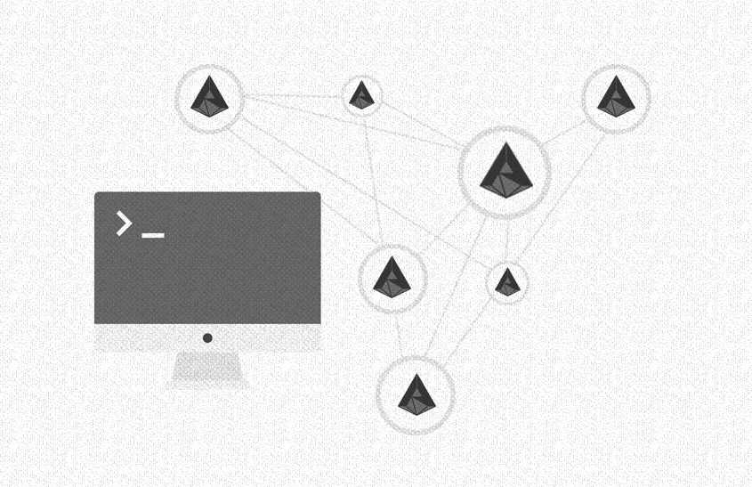

# ADAMANT

ADAMANT is a **decentralized, blockchain-based messaging platform**. Applications use ADAMANT as an anonymous, encrypted relay and storage layer for secure communication. Examples include the [Messenger app](https://github.com/Adamant-im/adamant-im), [Blockchain 2FA](https://github.com/Adamant-im/adamant-2fa), and [Exchange bot](https://github.com/Adamant-im/adamant-exchangebot).

For more information, refer to the ADAMANT website:

- Clear web: https://adamant.im
- Tor: http://adamantim24okpwfr4wxjgsh6vtw4odoiabhsfaqaktnfqzrjrspjuid.onion



Additional information:

- [How decentralized blockchain messenger works](https://news.adamant.im/how-decentralized-blockchain-messenger-works-b9932834a639)
- [Encryption overview in ADAMANT Messenger](https://news.adamant.im/encryption-overview-in-adamant-messenger-878ecec1ff78)

[](http://www.gnu.org/licenses/gpl-3.0)

## Node and API Documentation

Comprehensive [node documentation](https://docs.adamant.im) is available.

It covers the Fair dPoS consensus algorithm, decentralization principles, node installation and configuration, and other core concepts. The documentation also describes API endpoints for managing accounts, transactions, chats, and key-value storage (KVS), along with account creation, message encryption and decryption, and API data types.

See also:

- [ADAMANT Improvement Proposals (AIPs)](https://aips.adamant.im)

## Installing, Configuring, and Running an ADAMANT Node

ADAMANT Node requires Node.js 22.13.0 or newer. The installation scripts support Node.js 22, 24, and 26, with Node.js 24 selected by default.

Refer to the [ADAMANT Node installation documentation](https://docs.adamant.im/own-node/installation.html) for hardware requirements and complete setup instructions for Linux, macOS, and Windows.

### Linux Installation Scripts

The bundled installers support:

- Ubuntu 20.04, 22.04, 24.04, and 26.04 LTS: `tools/install_node.sh`
- RHEL-compatible releases 8-10, including CentOS Stream, Rocky Linux, AlmaLinux, and RHEL: `tools/install_node_centos.sh`

Ubuntu 20.04 is supported by the script, but its standard security maintenance has ended. Use Ubuntu Pro or upgrade the operating system for continued security updates.

Run an installer as root from the official download URL and select the network, Git branch, and Node.js major version as needed:

```sh
curl -fsSL https://adamant.im/install_node.sh | sudo bash -s -- -n mainnet -b master -j 24
curl -fsSL https://adamant.im/install_node_centos.sh | sudo bash -s -- -n testnet -b dev -j 24
```

Both installers update system packages, preserve existing ADAMANT configuration files and local Git changes, and reuse existing users and databases. A blockchain image is skipped when the selected database already contains tables. Installation logs are written to `/var/log/adamant_<network>_install.log`.

To replace an Ubuntu node database with a newly downloaded blockchain image, use:

```sh
sudo bash tools/fix_node.sh -n mainnet
```

The repair tool validates the downloaded image before dropping the database, but the database replacement itself is destructive. Back up any required data first. Repair logs are written to `/var/log/adamant_<network>_fix.log`.

### Critical Shutdown Notice

Always stop the node gracefully. When running it in the foreground, press `Ctrl+C` and wait for cleanup to finish. Do not use `kill -9`, forced terminal termination, or any other uncatchable process kill unless the process is already unrecoverably stuck.

The node stores derived consensus state in memory mirror tables such as `mem_accounts` and `mem_round`. A forced kill can interrupt block, transaction, or round writes and leave those tables inconsistent with the persisted blockchain. On the next startup this may force a full memory-state rebuild from the beginning of the chain:

```text
[WRN] loader Detected unapplied rounds in mem_round
[WRN] loader Recreating memory tables
[inf] loader Rebuilding blockchain, current block height: 1
```

If this happens, do not try to repair `mem_*` tables with manual SQL edits. The reliable recovery options are restoring a trusted database snapshot or letting the node rebuild/replay derived state from the blockchain.

## Development and Tests

Refer to [CONTRIBUTING.md](./.github/CONTRIBUTING.md).

## Authors

- ADAMANT community developers <devs@adamant.im>
- ADAMANT Foundation <devs@adamant.im>
- ADAMANT TECH LABS LP <devs@adamant.im>
- Boris Povod <boris@crypti.me>
- Pavel Nekrasov <landgraf.paul@gmail.com>
- Sebastian Stupurac <stupurac.sebastian@gmail.com>
- Oliver Beddows <oliver@lightcurve.io>
- Isabella Dell <isabella@lightcurve.io>
- Marius Serek <mariusz@serek.net>
- Maciej Baj <maciej@lightcurve.io>

## License

Copyright © 2025–2026 ADAMANT community developers

Copyright © 2020-2025 ADAMANT Foundation

Copyright © 2017-2020 ADAMANT TECH LABS LP

Copyright © 2016-2017 Lisk Foundation

This program is free software: you can redistribute it and/or modify it under the terms of the GNU General Public License as published by the Free Software Foundation, either version 3 of the License, or (at your option) any later version.

This program is distributed in the hope that it will be useful, but WITHOUT ANY WARRANTY; without even the implied warranty of MERCHANTABILITY or FITNESS FOR A PARTICULAR PURPOSE. See the GNU General Public License for more details.

You should have received a copy of the [GNU General Public License](https://github.com/LiskHQ/lisk/tree/master/LICENSE) along with this program. If not, see <http://www.gnu.org/licenses/>.

---

This program also incorporates work previously released with lisk `0.7.0` (and earlier) versions under the [MIT License](https://opensource.org/licenses/MIT). To comply with the requirements of that license, the following permission notice, applicable to those parts of the code only, is included below:

Copyright © 2016-2017 Lisk Foundation

Copyright © 2015 Crypti

Permission is hereby granted, free of charge, to any person obtaining a copy of this software and associated documentation files (the "Software"), to deal in the Software without restriction, including without limitation the rights to use, copy, modify, merge, publish, distribute, sublicense, and/or sell copies of the Software, and to permit persons to whom the Software is furnished to do so, subject to the following conditions:

The above copyright notice and this permission notice shall be included in all copies or substantial portions of the Software.

THE SOFTWARE IS PROVIDED "AS IS", WITHOUT WARRANTY OF ANY KIND, EXPRESS OR IMPLIED, INCLUDING BUT NOT LIMITED TO THE WARRANTIES OF MERCHANTABILITY, FITNESS FOR A PARTICULAR PURPOSE AND NONINFRINGEMENT. IN NO EVENT SHALL THE AUTHORS OR COPYRIGHT HOLDERS BE LIABLE FOR ANY CLAIM, DAMAGES OR OTHER LIABILITY, WHETHER IN AN ACTION OF CONTRACT, TORT OR OTHERWISE, ARISING FROM, OUT OF OR IN CONNECTION WITH THE SOFTWARE OR THE USE OR OTHER DEALINGS IN THE SOFTWARE.
